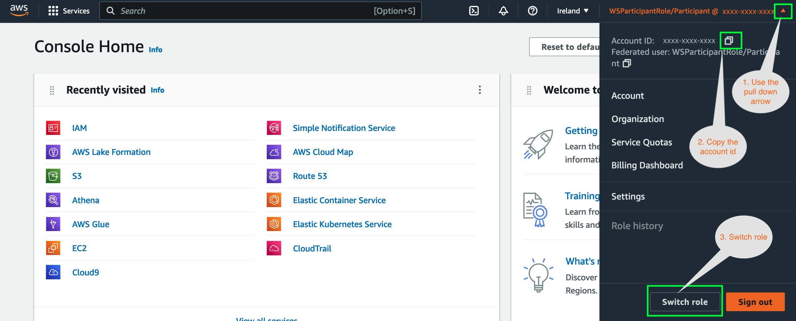
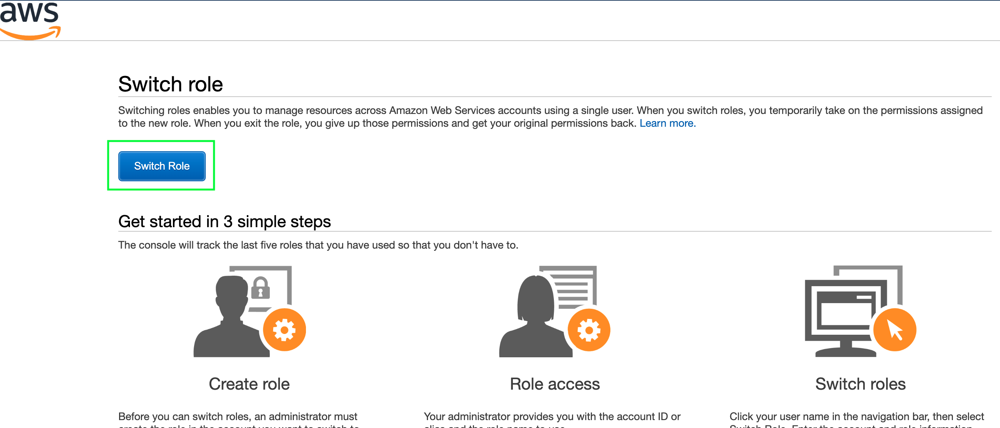
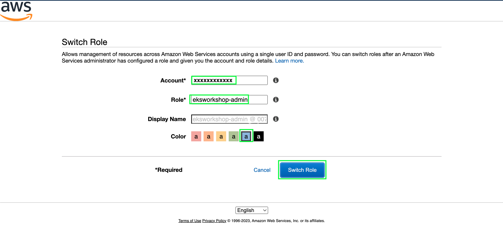

We now need to switch our console's role to `eksworkshop-admin` a specially created role for this workshop

Now use the top right hand corner to switch roles:

------

If this screen appears simply click `Switch Role`

----

Paste in the Account ID you saved and enter the role name `eksworkshop-admin` and click `switch role`

-----

### [Next](./workspace.md)

