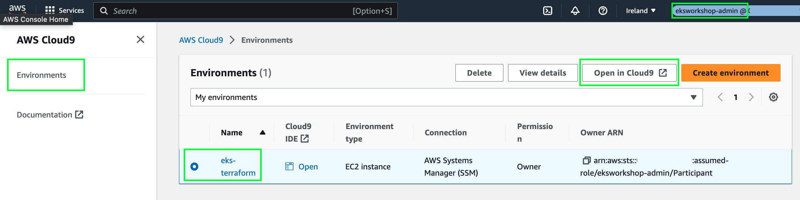
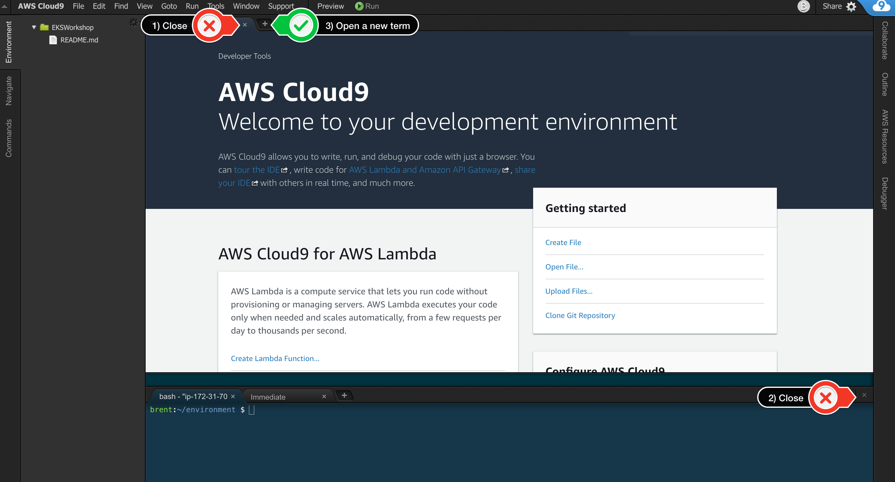
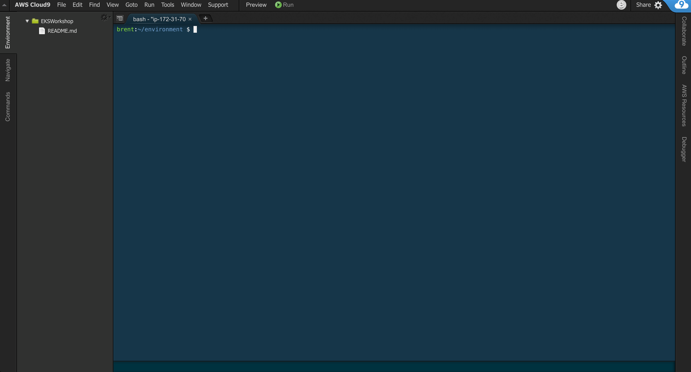

## Open the Workspace

----

#### Ad blockers, javascript disabler, and tracking blockers should be disabled for the cloud9 domain, or connecting to the workspace might be impacted. Cloud9 requires third-party-cookies. You can whitelist the [specific domains]( https://docs.aws.amazon.com/cloud9/latest/user-guide/troubleshooting.html#troubleshooting-env-loading).

----

### Open the pre-created Cloud9 Desktop Environment:

Select the `eks-terraform` Cloud9 Environment using this link: [https://eu-west-2.console.aws.amazon.com/cloud9/home](https://eu-west-2.console.aws.amazon.com/cloud9/home)

- Click **`Open in Cloud9`**

-----

On the next screen choose these options:

When it comes up, customize the environment by closing the **welcome tab**
and **lower work area**, and opening a new **terminal** tab in the main work area:

----

- Your workspace should now look like this:

- If you like this theme, you can choose it yourself by selecting **View / Themes / Solarized / Solarized Dark**
in the Cloud9 workspace menu.

----

## [Next](../k8stools.md)