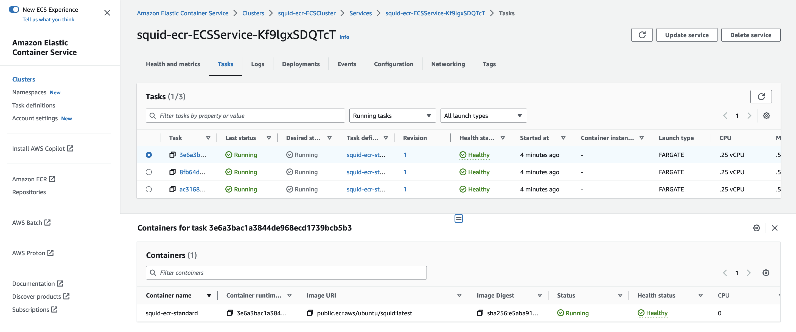

## Deploy the squid proxy on ECS

In Lab 1 we will deploy and use the centralised squid on ECS/Fargate pattern 


As described in this [AWS blogpost](https://aws.amazon.com/blogs/networking-and-content-delivery/providing-controlled-internet-access-through-centralised-proxy-servers-using-aws-fargate-and-privatelink/){:target="_blank"}


The AWS CloudFormation deployment template used in the blog post has been refactored to Terraform for DVSA in this lab.

----

### Examine the Terraform files

```bash
cd ~/environment/ecs-squid/lab1/tf-squid
```

### Deploy the squid application

```bash
terraform init
terraform validate
terraform plan -out tfplan
terraform apply tfplan
```

### Use the AWS console to verify / explore the deployment

Using the console find and explore these resources

* [The ECS Clusters](https://eu-west-1.console.aws.amazon.com/ecs/v2/clusters){:target="_blank"}


* [ECS service](https://eu-west-1.console.aws.amazon.com/ecs/v2/clusters/squid-ecr-ECSCluster/services?region=eu-west-1){:target="_blank"}


* [ECS tasks](https://eu-west-1.console.aws.amazon.com/ecs/v2/clusters/squid-ecr-ECSCluster/tasks?region=eu-west-1){:target="_blank"}



* [Task definitions](https://eu-west-1.console.aws.amazon.com/ecs/v2/task-definitions?region=eu-west-1){:target="_blank"}


Note which task definition is deployed and which container image is being used.

* [Load Balancers](https://eu-west-1.console.aws.amazon.com/ec2/home?region=eu-west-1#LoadBalancers:){:target="_blank"}


* [Target Groups](https://eu-west-1.console.aws.amazon.com/ec2/home?region=eu-west-1#TargetGroups:){:target="_blank"}


-------

### Setup a custom squid docker image


Examine the files in this directory

```bash
cd ~/environment/ecs-squid/lab1/squid-docker
```

including our own allow list `allowedlist.txt` which contains one entry:

```
aws.amazon.com
```

And the `Dockerfile` for building the custom container image.


----


The following script will then use these files to build a custom image for squid - using a CICD pipeline that has already been setup:


```bash
cd ~/environment/ecs-squid/lab1/scripts
./custom-squid.sh
```

**Wait for 30 seconds or so before proceeding - to ensure you catch the latest run of code pipeline**

----

Track the build in [code pipeline](https://eu-west-1.console.aws.amazon.com/codesuite/codepipeline/pipelines?region=eu-west-1){:target="_blank"}  and 
[code build](https://eu-west-1.console.aws.amazon.com/codesuite/codebuild/projects?region=eu-west-1){:target="_blank"}

After the built completes:
Observe the [ECR repo](https://eu-west-1.console.aws.amazon.com/ecr/repositories?region=eu-west-1){:target="_blank"} for the new custom squid image


-------

## Adjust Terraform to deploy our custom squid container

### Check the ECR repo for the custom squid image

```bash
cd ~/environment/ecs-squid/lab1/tf-squid
```

Observe the difference in these two files definition of which image to use:

```bash
grep task_definition aws_ecs_service__squid-ecr-ECSService.tf
```

```bash
grep task_definition aws_ecs_service__squid-ecr-ECSService.tf.custom
```

and the corresponding different images in the task definitions

```bash
grep image aws_ecs_task_definition__squip--standard-ecr-ECSTaskDefinition.tf
```

image = "public.ecr.aws/ubuntu/**squid**:latest"

```bash
grep image aws_ecs_task_definition__squid--custom-ecr-ECSTaskDefinition.tf
```

image = format("%s.dkr.ecr.%s.amazonaws.com/**squid-ecr-ecrrepository**:latest", data.aws_caller_identity.current.account_id, data.aws_region.current.name)


Next copy the custom service definition into place:

```bash 
cp aws_ecs_service__squid-ecr-ECSService.tf.custom aws_ecs_service__squid-ecr-ECSService.tf
```

Confirm the change being made with terraform plan

```bash
terraform plan -out tfplan
```

Apply the change:

```bash
terraform apply tfplan
```

-------


## Deploy a test instance


```bash
cd ~/environment/ecs-squid/lab1/test-instance
```

```bash
terraform init
terraform validate
terraform plan -out tfplan
terraform apply tfplan
```

----------

From your Cloud9 IDE terminal get and save the VPC endpoint DNS entry:

```bash
aws ssm get-parameter --name /ecsworkshop/proxy-dns --query Parameter.Value --output text
```

Connect to the instance via [SSM Fleet](https://eu-west-1.console.aws.amazon.com/systems-manager/managed-instances?region=eu-west-1){:target="_blank"}

Select the instance "test-squid"
Use the option, `Node action` then `Start terminal session`


From the OS prompt:

```bash
proxyurl=<the value you saved from the Cloud9 IDE>
export http_proxy=http://${proxyurl}:3128
export https_proxy=http://${proxyurl}:3128
```


### this works:

```bash
curl https://aws.amazon.com
```

### this does not (403 error):

```bash
curl https://www.microsoft.com
```

-------


### Cleanup


**From the Cloud9 Terminal**

```bash
cd ~/environment/ecs-squid/lab1/test-instance
terraform destroy -auto-approve
```


----

## [Next](./LAB-2.md)


