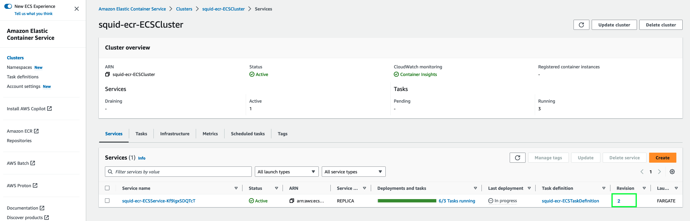

## Deploy the squid proxy on ECS

In Lab 1 we will deploy and use the centralised squid on ECS/Fargate pattern 


As described in this [AWS blogpost](https://aws.amazon.com/blogs/networking-and-content-delivery/providing-controlled-internet-access-through-centralised-proxy-servers-using-aws-fargate-and-privatelink/){:target="_blank"}


The AWS CloudFormation deployment template used in the blog post has been refactored to Terraform for DVSA in this lab.

----

### Examine the Terraform files

```bash
cd ~/environment/ecs-squid/lab1/tf-squid
```

### Deploy the squid proxy onto ECS

```bash
terraform init
terraform validate
terraform plan -out tfplan
terraform apply tfplan

```

### Use the AWS console to verify / explore the deployment

Using the console find and explore these resources

* [The ECS Clusters](https://eu-west-1.console.aws.amazon.com/ecs/v2/clusters){:target="_blank"}


----


* [ECS Services](https://eu-west-1.console.aws.amazon.com/ecs/v2/clusters/squid-ecr-ECSCluster/services?region=eu-west-1){:target="_blank"}


-----


* [ECS Tasks](https://eu-west-1.console.aws.amazon.com/ecs/v2/clusters/squid-ecr-ECSCluster/tasks?region=eu-west-1){:target="_blank"}


Note the `Image URI` in the bottom half of the screen


------

* [Task Definitions](https://eu-west-1.console.aws.amazon.com/ecs/v2/task-definitions?region=eu-west-1){:target="_blank"}


Click the task definitions name to see more details

Note which task definition is deployed and which container image is being used.

----

* [Load Balancers](https://eu-west-1.console.aws.amazon.com/ec2/home?region=eu-west-1#LoadBalancers:){:target="_blank"}


Select the Load Balancers radio box the see/explore more details

----

* [Target Groups](https://eu-west-1.console.aws.amazon.com/ec2/home?region=eu-west-1#TargetGroups:){:target="_blank"}


Select the target group radio box the see/explore more details

-------


## Setup a custom squid docker image


Examine the files in this directory

```bash
cd ~/environment/ecs-squid/lab1/squid-docker
```

including our own allow list `allowedlist.txt` which contains one entry:

```
aws.amazon.com
```

And the `Dockerfile` for building the custom container image.


----


The following script will then use these files to build a custom image for squid - using a CICD pipeline that has already been setup - this is triggered by committing the files to the codecommit repository (previously setup):


```bash
cd ~/environment/ecs-squid/lab1/scripts
./custom-squid.sh
```

**Wait for 30 seconds or so before proceeding - to ensure you catch the latest run of code pipeline**

----

Track the build in [code pipeline](https://eu-west-1.console.aws.amazon.com/codesuite/codepipeline/pipelines?region=eu-west-1){:target="_blank"}  You should see the pipeline "in progress"


----

You can also track the build part of the pipeline in [code build](https://eu-west-1.console.aws.amazon.com/codesuite/codebuild/projects?region=eu-west-1){:target="_blank"}

----


After the build is completed look for the new Docker image in the [ECR repo](https://eu-west-1.console.aws.amazon.com/ecr/repositories?region=eu-west-1){:target="_blank"} for the new custom squid image.


In due course the [code pipeline](https://eu-west-1.console.aws.amazon.com/codesuite/codebuild/projects?region=eu-west-1){:target="_blank"} will complete including the deploy stage


This pipleine included as part of the `Build` stage:

* Builds a docker image using the Dockerfile and other files in our codecommit repo
* Pushes the built image to ECR
* Created a build artifact `imageDetail.json` and stored in in the [S3 bucket](https://s3.console.aws.amazon.com/s3/home?region=eu-west-1#){:target="_blank"}  : `squid-ecr-codepipeartifact-xxxxxxxxxxxx-eu-west-1/squid-ecr-SquidProxy/BuildOutpu/`

`imageDetail.json` is a zipped file and contains content like the following:

```
[
    {   
        "name":"squid-ecr-SquidProxyContainer",
        "imageUri":"xxxxxxxxxxxx.dkr.ecr.eu-west-1.amazonaws.com/squid-ecr-ecrrepository:latest"
    }
]
```

This artifact/file is passed into the `Deploy` stage (targeting ECS):

* The deployment engine then finds any task definitions with the container label `squid-ecr-SquidProxyContainer` in our cluster and service. (see the contents of the aws_codepipeline*.tf file)
* Creates a new verison of the task definition - with an updated imageUri to match the contents above
* Triggers the ECS service using that task definition to redeploy with the updated task definition version

-------

## Verify the code pipeline changes

Using the console

* Check you see two versions of the task definition


* Check the newest version of the task definition refers to the Image URI in the ECR repo.


* Check the ECS service is deploying / has finished deploying (Completed) new tasks using the new task definition version (ie. not version 1)




-------


## Deploy a test instance


```bash
cd ~/environment/ecs-squid/lab1/test-instance
```

```bash
terraform init
terraform validate
terraform plan -out tfplan
terraform apply tfplan

```

----------

From your Cloud9 IDE terminal get and save the VPC endpoint DNS entry:

```bash
aws ssm get-parameter --name /ecsworkshop/proxy-dns --query Parameter.Value --output text
```

Save this to your clipboard (crtl-C)

Connect to the instance via [SSM Fleet](https://eu-west-1.console.aws.amazon.com/systems-manager/managed-instances?region=eu-west-1){:target="_blank"}

Select the instance "test-squid"
Use the option, `Node action` then `Start terminal session`


From the OS prompt:

```bash
proxyurl=<the value you saved from the Cloud9 IDE>
export http_proxy=http://${proxyurl}:3128
export https_proxy=http://${proxyurl}:3128
```


### this works:

```bash
curl https://aws.amazon.com
```

### this does not (403 error):

```bash
curl https://www.microsoft.com
```


-------

### Optional: Add Microsoft to the allowed list

```bash
cd ~/environment/ecs-squid/lab1/scripts/squid-proxy 
echo "www.microsoft.com" >> allowedlist.txt
git add .
git commit -m "added Microsoft"
git push origin main
```

As before observe the pipleine stages and the ECS service redeployment to completion.


redo the `curl https://www.microsoft.com` in the test instance terminal (not in Cloud9)


Next - close the fleet manager terminal session using the `Terminate` button.

-----

### Cleanup


**From the Cloud9 Terminal**

Cleanup the test instance and only the test instance, please do not delete anything else.

```bash
cd ~/environment/ecs-squid/lab1/test-instance
terraform destroy -auto-approve
```


----

## [Next](./LAB-2.md)


