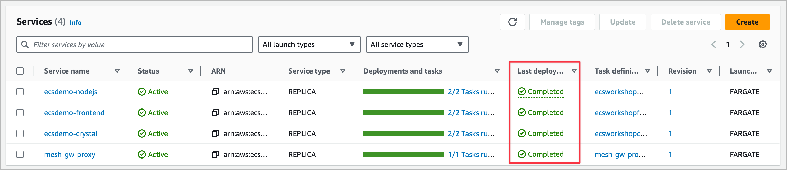
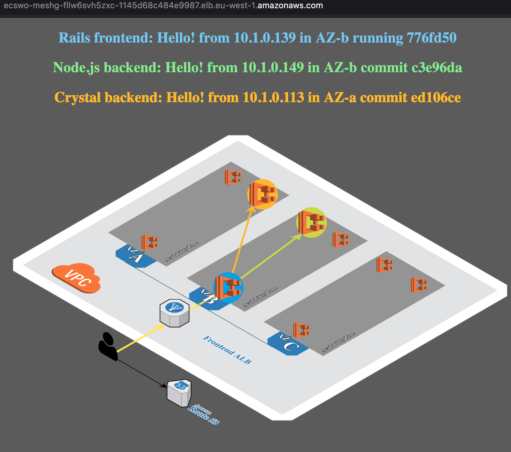
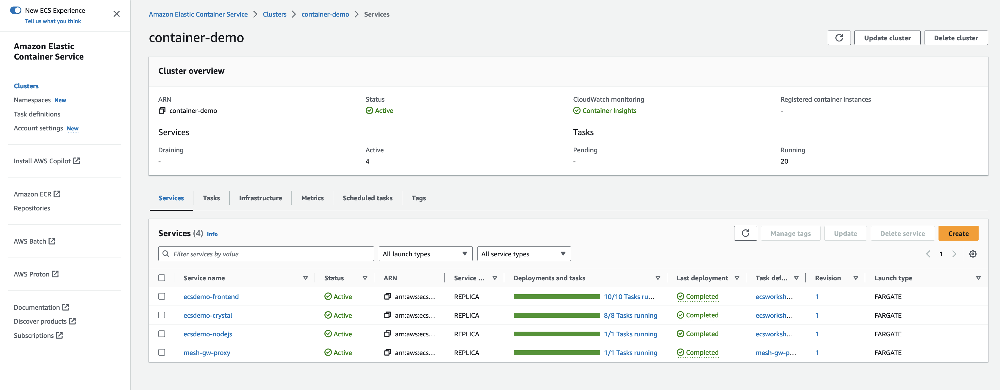
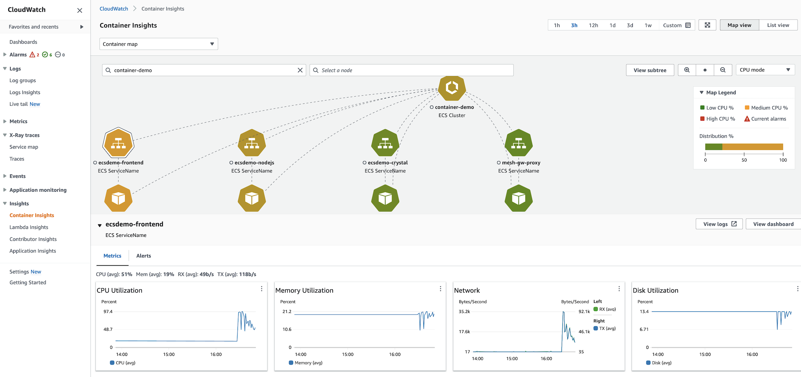
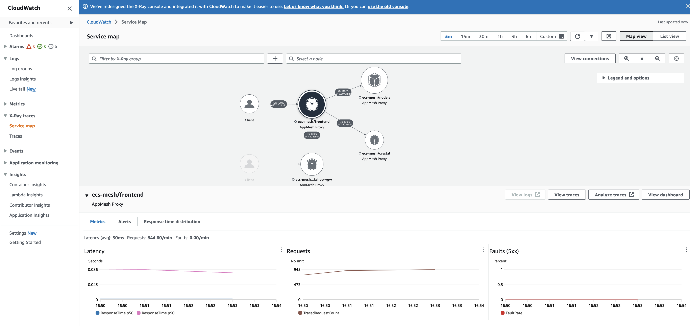

## Deploy the sample microserves app and explore observability

### Build the sample application with Terraform

```bash
cd ~/environment/ecs-squid/lab2/mesh-microservice-app/
```

```bash
terraform init
terraform plan -out tfplan
terraform apply tfplan

```


----

Monitor the [ECS console](https://eu-west-1.console.aws.amazon.com/ecs/v2/clusters/container-demo/services?region=eu-west-1){:target="_blank"} and wait for all the services Last Deployment state to be indicated as `Completed`




### Start a siege (workload)

In Cloud9 open a **new terminal window**:

get the load balancer DNS name

```bash
lbdns=$(aws ssm get-parameter --name /ecsworkshop/meshlb-dns --query Parameter.Value --output text)
echo $lbdns
```

Open a new browser tab on that website address and you should see an animation that looks like this:



-----

Then back in your new terminal window start a "siege":

```bash
siege -c 20 -i http://$lbdns
```

Note some of the initial response times from the siege

----

After a few minutes you should be able to see the autoscaling of the frontend and crystal services:



You may also notice the lower response times reported by siege.

And the website graphic in the browser showing more frontend and backends responding to queries.

*What can you find in CloudWatch (Alarms) and the ECS Service definition that caused this auto scaling to happen?*

*Where was this defined in the Terraform files?*


----

### Explore the observabilty of the deployed application:


#### Let’s review the Container Insights in the console

To review the information, you need to go to the [Cloudwatch console](https://eu-west-1.console.aws.amazon.com/cloudwatch/home?region=eu-west-1#container-insights:infrastructure/map){:target="_blank"} and select the Insight section, then select Container Insights.

Within this console you will find different views, like the Map View, that will let you see in a graphical representation the services and task of you ECS cluster and some metrics when you select the service from the map:




#### Review traces with X-Ray


Once we have deployed them we will need to wait a few minutes to start seeing traces. Now access the [X-Ray console.](https://eu-west-1.console.aws.amazon.com/cloudwatch/home?region=eu-west-1#xray:service-map/map){:target="_blank"}


Once in the X-Ray console, select Service Map from the left hand side menu. Wait a few seconds for the service map to render.

Whenever you select a node or edge on an AWS X-Ray service map, the X-Ray console shows additional information about the node or edge.




To see the detailed trace information click the `view traces` button.

----


## [Next](./LAB-3.md)

